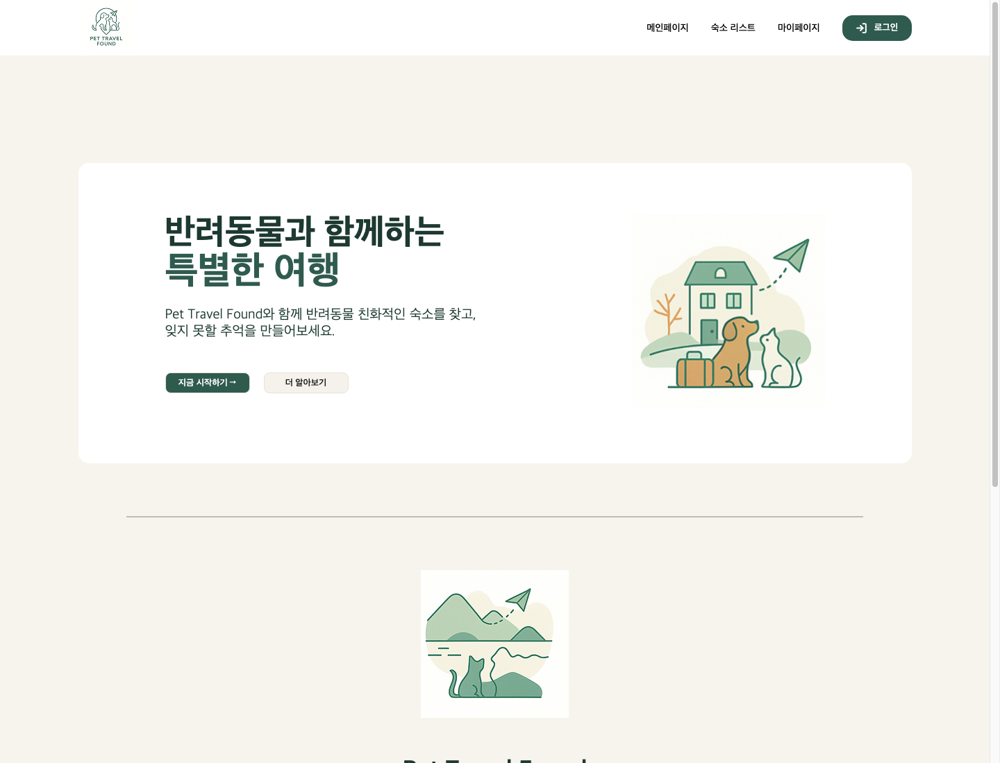
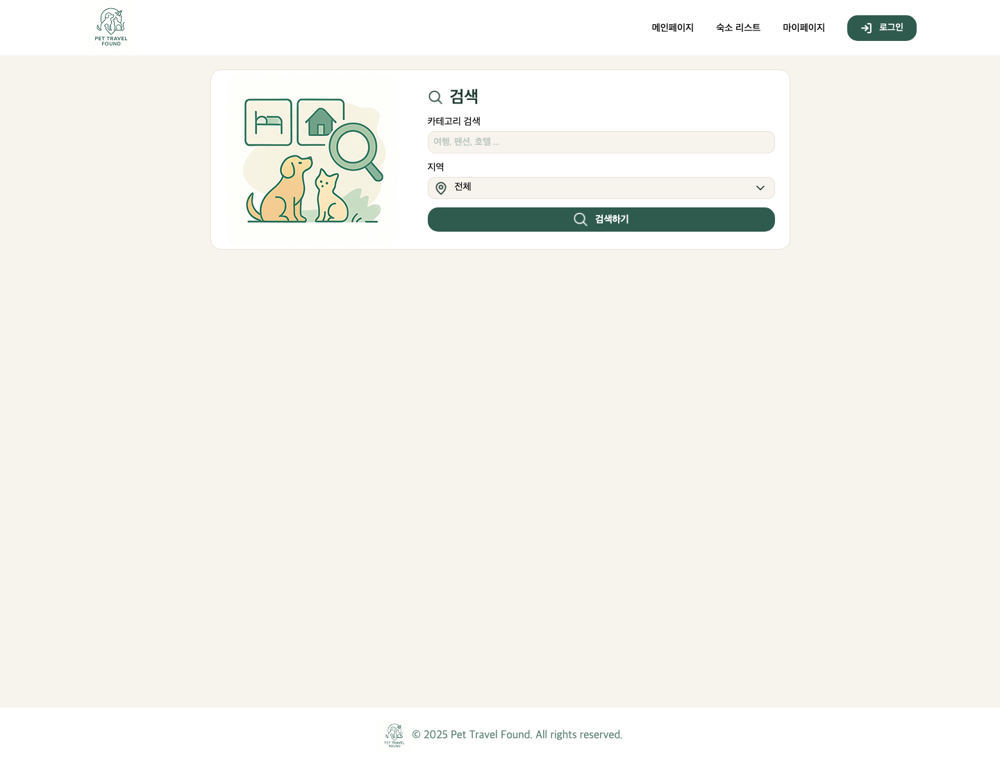
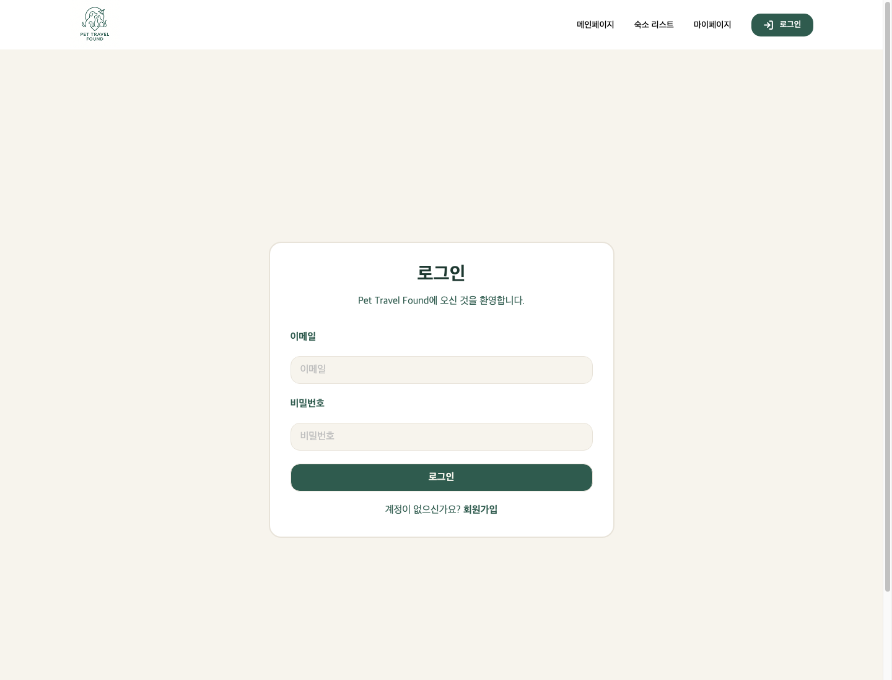
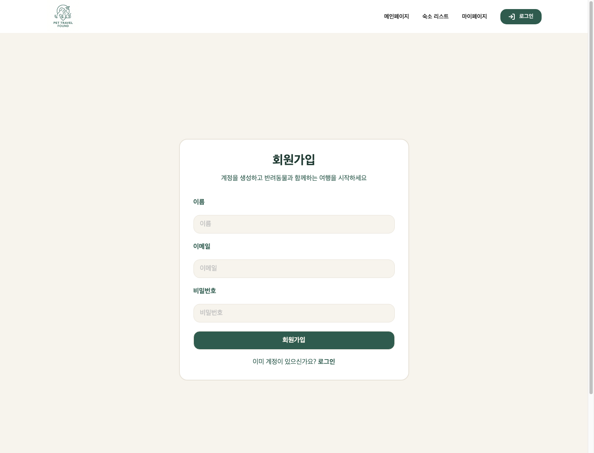
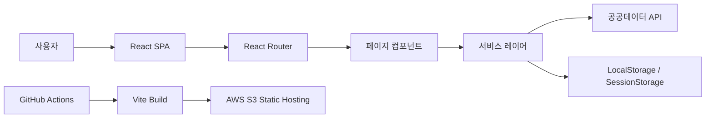

# Pet Travel Found

<div align="center">
  
  <br />
  <br />
</div>

# Pet Travel Found

> **반려동물 동반 숙소 검색·예약 서비스** <br />
> **개발기간: 2025.10 ~ 2025.12**

## 배포 주소

> **서비스 URL** : http://dev-web-ide-fe-prod-apne2.s3-website-ap-southeast-2.amazonaws.com/ <br />
> **프론트엔드 배포** : AWS S3 정적 웹 호스팅 기반 배포 파이프라인 구성 <br />
> **배포 자동화** : GitHub Actions를 통한 빌드 및 S3 업로드 자동화 <br />
> **배포 문서** : [S3_IAM_Project_Deploy_Setup.md](./aws/S3_IAM_Project_Deploy_Setup.md)
> **배포 링크** : http://pet-travel-found-bucket.s3-website-ap-southeast-2.amazonaws.com/

## 프로젝트 소개

Pet Travel Found는 반려동물과 함께 여행하는 사용자가 동반 가능한 숙소를 검색하고 예약할 수 있도록 만든 React 기반 웹 서비스입니다.

사용자는 지역과 카테고리 키워드로 숙소를 탐색하고, 상세 화면에서 숙소 정보와 편의시설을 확인한 뒤 예약 및 결제 흐름으로 이동할 수 있습니다. 회원가입과 로그인은 브라우저 저장소를 활용해 구현했으며, 예약 내역은 마이페이지에서 확인할 수 있습니다.

프론트엔드 단일 프로젝트로 구성되어 있으며, 숙소 데이터는 공공데이터 API 연동을 통해 조회합니다. 또한 팀 프로젝트 운영을 위해 코드 스타일 자동화, 커밋 전 검사, 코드 리뷰 봇, GitHub Actions 기반 CI/CD, AWS S3 배포 문서를 함께 구성했습니다.

## 시작 가이드

### Requirements

For building and running the application you need:

- [Node.js 22.x](https://nodejs.org/)
- [pnpm 10.x](https://pnpm.io/)

### Environment Variables

프로젝트 루트에 `.env` 파일을 생성하고 아래 환경변수를 설정해야 합니다.

```bash
VITE_PET_PLACE_API_URL=공공데이터_API_URL
VITE_PET_PLACE_API_KEY=공공데이터_API_KEY
```

### Installation

```bash
$ git clone https://github.com/goorm-fullstack-team-1/pet-travel-found.git
$ cd pet-travel-found
$ pnpm install
$ pnpm dev
```

### Build

```bash
$ pnpm build
$ pnpm preview
```

## Stacks

### Environment


### Config


### Development


### Deploy


### Communication


## 화면 구성

| 메인 페이지 | 숙소 리스트 페이지 |
| :---: | :---: |
|  |  |

| 로그인 페이지 | 회원가입 페이지 |
| :---: | :---: |
|  |  |

## 주요 기능

### 숙소 검색

- 카테고리 키워드와 지역 필터를 기반으로 반려동물 동반 가능 숙소 조회
- 공공데이터 API를 활용한 숙소 목록 데이터 연동
- 숙소명, 주소, 카테고리, 평점, 가격 정보를 카드 형태로 제공

### 숙소 상세 확인

- 리스트에서 선택한 숙소의 상세 정보와 위치, 설명, 편의시설 제공
- 상세 화면에서 예약 페이지로 이어지는 예약 흐름 구성

### 회원 인증

- 회원가입, 로그인, 로그아웃 기능 구현
- SHA-256 해시를 활용한 비밀번호 저장 처리
- 로그인 여부에 따라 예약, 결제, 마이페이지 접근 제어

### 예약 및 결제

- 체크인, 체크아웃 날짜와 인원 입력을 통한 예약 정보 구성
- 결제 화면에서 숙박 일수와 총 결제 금액 계산
- 결제 민감 정보 해시 처리 후 예약 내역 저장

### 마이페이지

- 로그인한 사용자의 기본 정보 표시
- 사용자별 예약 내역 조회

### 협업 및 운영 자동화

- ESLint, Prettier로 코드 스타일 표준화
- Husky, lint-staged로 커밋 전 자동 검사 및 포맷팅 적용
- CodeRabbit 연동을 통한 코드 리뷰 자동화
- GitHub Rulesets로 main 브랜치 직접 push 및 force push 제한
- GitHub Actions와 AWS S3 기반 CI/CD 파이프라인 구축

## 아키텍처

### 서비스 흐름



### 디렉토리 구조

```bash
.
├── README.md
├── aws
│   └── S3_IAM_Project_Deploy_Setup.md
├── docs
│   ├── screenshots
│   └── 페이지별 기능 문서
├── public
├── src
│   ├── assets
│   │   └── images
│   ├── components
│   │   ├── Button
│   │   ├── Footer
│   │   ├── Header
│   │   └── Icon
│   ├── pages
│   │   ├── AuthPage
│   │   ├── BookingPage
│   │   ├── DetailPage
│   │   ├── ListPage
│   │   ├── MainPage
│   │   ├── MyPage
│   │   └── PaymentPage
│   ├── services
│   │   ├── api
│   │   ├── auth
│   │   ├── payment
│   │   ├── petPlace
│   │   └── storage
│   └── utils
├── eslint.config.js
├── package.json
├── pnpm-lock.yaml
└── vite.config.js
```

## 관련 문서

- [Main Page](./docs/main-page.md)
- [List Page](./docs/list-page.md)
- [Detail Page](./docs/detail-page.md)
- [Booking Page](./docs/booking-page.md)
- [Payment Page](./docs/payment-page.md)
- [My Page](./docs/my-page.md)
- [Auth Page](./docs/auth-page.md)
- [AWS S3 배포 문서](./aws/S3_IAM_Project_Deploy_Setup.md)
